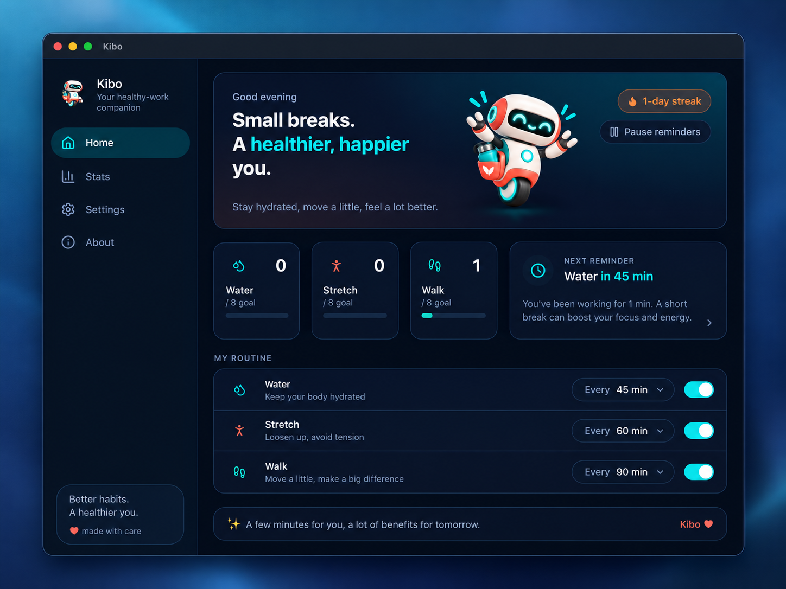
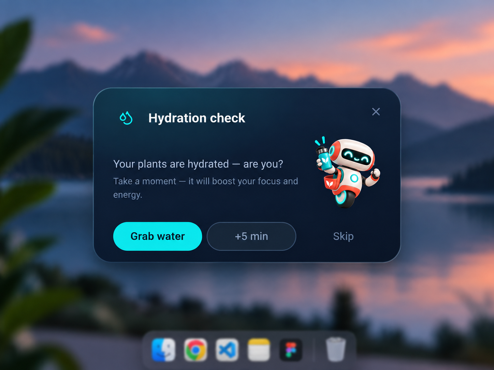
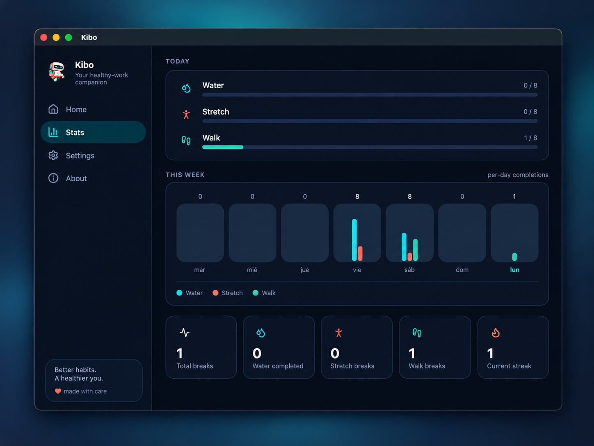
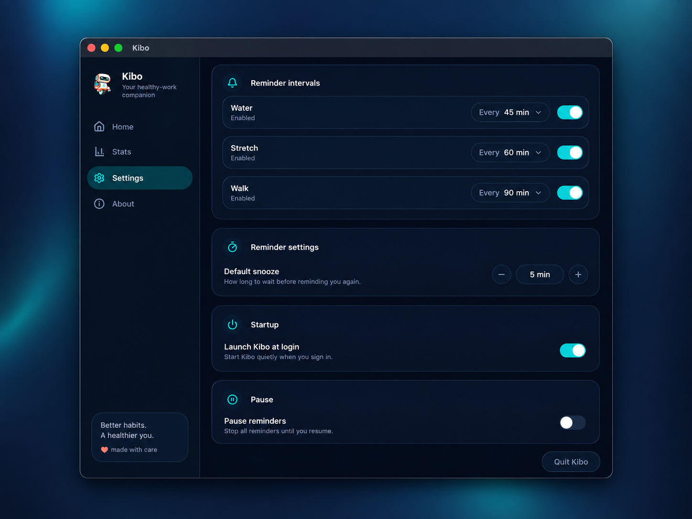

# Kibo 🤖

**Your friendly healthy-work companion.**

Kibo is an open-source desktop companion that helps you build healthier habits while working at your computer. It quietly lives in your menu bar, keeps an eye on how long you've been sitting still, and nudges you — with a friendly robot — to drink water, stretch, and take a walk.

<p align="center">
  <a href="https://github.com/JvierDev/kibo">
    
  </a>
  <a href="https://github.com/JvierDev/kibo">
    
  </a>
  <a href="https://github.com/JvierDev/kibo">
    
  </a>
</p>

<p align="center">
  
</p>

---

## Description

Kibo is a wellness companion for people who spend long hours at their computer. It tracks your reminder schedule, checks in when you've been working too long without a break, and celebrates with you when you take care of yourself — one glass of water, one stretch, and one walk at a time.

## Features

- 💧 **Water, stretch & walk reminders** — configurable intervals for each habit
- ⏰ **Smart snooze** — "not now, but remind me soon"
- ⏸️ **Pause / resume** — take control whenever you need quiet time
- 🧠 **Activity-aware timing** — Kibo detects idle time, screen locks, and system sleep, and resets your clocks automatically so it never bugs you mid-break
- 🖥️ **Menu bar companion** — quick actions, pause, and an at-a-glance "Next reminder" status from the system tray
- 🤖 **Floating mascot window** — an always-on-top robot that appears at the bottom-right of your screen when it's time for a break
- 📊 **Daily & weekly stats** — completed breaks, daily goals, weekly charts, and your healthy streak
- 🚀 **Launch at login** — start quietly and stay out of the way
- 🎉 **Milestone celebrations** — Kibo celebrates your progress as your counts grow
- 🔇 **Lightweight & private** — everything runs locally, nothing leaves your machine

## Screenshots

### Friendly reminders

Kibo appears with lightweight reminders that stay out of your way.

<p>
  
</p>

### Stats & Settings

<table>
  <tr>
    <td align="center">
      
      <br />
      <sub><b>Track your daily and weekly progress</b></sub>
    </td>
    <td align="center">
      
      <br />
      <sub><b>Customize reminders and startup behavior</b></sub>
    </td>
  </tr>
</table>

## How Kibo works

Kibo runs quietly in the background and keeps a schedule for each habit:

1. Add your routine. By default Kibo reminds you to **drink water** every 45 minutes, **stretch** every 60 minutes, and **take a walk** every 90 minutes.
2. Kibo checks the schedule every 15 seconds. When a reminder is due, a friendly mascot window pops up in the corner with a gentle chime — plus a system notification when you're away.
3. Tell Kibo what you did:
   - **Done** — Kibo records it and celebrates. 🎉
   - **Snooze** — come back again in a few minutes.
   - **Skip** — no worries, the clock restarts.
4. If you've gone idle, locked your screen, or put your machine to sleep, Kibo assumes you took a real break and resets the clocks automatically.
5. Your completions are tracked locally each day, charted for the week, and rolled into your streak.

## Tech stack

| Layer       | Technology                                      |
| ----------- | ----------------------------------------------- |
| Desktop     | [Electron](https://www.electronjs.org/)         |
| UI          | [React](https://react.dev/)                     |
| Language    | [TypeScript](https://www.typescriptlang.org/)   |
| Bundler     | [electron-vite](https://electron-vite.org/)     |
| Styling     | [Tailwind CSS](https://tailwindcss.com/)        |
| Package mgr | [pnpm](https://pnpm.io/)                        |
| Testing     | [Vitest](https://vitest.dev/)                   |
| Packaging   | [electron-builder](https://www.electron.build/) |

## Architecture

Kibo follows a clean, three-part Electron architecture with shared code between processes:

```
┌───────────────────────────┐
│      MAIN PROCESS         │
│  windows · tray · ipc     │
│  reminderEngine           │
│  activityMonitor · store  │
│  stats                    │
└──────────┬────────────────┘
           │ IPC (typed contracts)
┌──────────▼────────────────┐
│        PRELOAD            │
│  contextBridge · kibo API │
└──────────┬────────────────┘
           │
┌──────────▼───────────────┐
│      RENDERER            │
│  React UI · mascot ·     │
│  pages (Home/Stats/...)  │
└──────────────────────────┘

        ┌─ shared/ ────────┐
        │ types · IPC ids  │  ← reused by all processes
        └──────────────────┘
```

- **Main process** — system integration: windows, tray, the reminder engine, activity/idle detection, persistent storage, and packaging.
- **Preload** — exposes a safe, typed `window.kibo` API to the renderer via `contextBridge`.
- **Renderer** — the React UI: pages, components, and the mascot window.
- **Shared** — TypeScript types and IPC channel names reused across every layer, keeping the whole app type-safe.

## Project structure

```
kibo/
├── src/
│   ├── main/                    # Electron main process
│   │   ├── activityMonitor.ts   # Idle / lock / suspend detection
│   │   ├── index.ts             # App entry point
│   │   ├── ipc.ts               # IPC handler registration
│   │   ├── reminderEngine.ts    # Reminder scheduling engine
│   │   ├── stats.ts             # Daily / weekly / streak stats
│   │   ├── store.ts             # Persistent settings & stats
│   │   ├── tray.ts              # Menu bar integration
│   │   └── windows.ts           # Main & mascot windows
│   ├── preload/                 # contextBridge API for the renderer
│   ├── renderer/                # React frontend
│   │   └── src/
│   │       ├── App.tsx          # Root component & routing
│   │       ├── main.tsx
│   │       ├── components/      # Reusable UI components
│   │       ├── mascot/          # Floating mascot window logic
│   │       ├── lib/             # Hooks & habit definitions
│   │       ├── pages/           # Home / Stats / Settings / About
│   │       └── assets/          # Mascot images & styles
│   └── shared/                  # Types & IPC contracts for all processes
├── build/                       # Icons & template assets
├── scripts/                     # Dev / build helpers
├── electron-builder.yml         # Packaging configuration
├── electron.vite.config.ts      # electron-vite configuration
└── package.json
```

## Getting started

### Prerequisites

- [Node.js](https://nodejs.org/) **20+** (LTS recommended)
- [pnpm](https://pnpm.io/) **9+**
- **macOS 11+** (primary target)

### Installation

```bash
# Clone the repository
git clone https://github.com/JvierDev/kibo.git
cd kibo

# Install dependencies
pnpm install
```

### Development

```bash
# Start the app in development mode with hot reload
pnpm dev
```

### Available scripts

| Script                | Description                               |
| --------------------- | ----------------------------------------- |
| `pnpm dev`            | Start the app in development mode         |
| `pnpm build`          | Build the app with electron-vite          |
| `pnpm start`          | Preview the built app                     |
| `pnpm test`           | Run the test suite (Vitest)               |
| `pnpm typecheck`      | Type-check main + renderer                |
| `pnpm typecheck:node` | Type-check the Node/main process          |
| `pnpm typecheck:web`  | Type-check the web/renderer code          |
| `pnpm build:mac`      | Build & package for macOS (DMG)           |
| `pnpm build:win`      | Build & package for Windows (NSIS)        |
| `pnpm build:linux`    | Build & package for Linux (AppImage, deb) |

### Building / packaging

Kibo is packaged with [electron-builder](https://www.electron.build/). The configuration lives in `electron-builder.yml` and produces native installers:

```bash
pnpm build:mac      # → macOS DMG
pnpm build:win      # → Windows NSIS installer
pnpm build:linux    # → Linux AppImage + deb
```

Build artifacts are written to `dist/`.

## Platform support

| Platform | Status                                  |
| -------- | --------------------------------------- |
| macOS    | ✅ Primary target                       |
| Windows  | 🚧 Packaging configured (NSIS)          |
| Linux    | 🚧 Packaging configured (AppImage, deb) |

## Roadmap

Ideas under consideration — contributions are always welcome:

- [ ] Windows & Linux polish and validation
- [ ] More habits and fully customizable intervals
- [ ] Extra mascot expressions and celebrations
- [ ] Sound options and volume control
- [ ] Optional system notifications on all platforms
- [ ] Localization (i18n)
- [ ] Exportable health stats

## Contributing

Contributions are what make the open-source community such an amazing place to learn, inspire, and create. Any contributions you make are **greatly appreciated** 💙

1. Fork the project
2. Create your feature branch (`git checkout -b feature/amazing-feature`)
3. Commit your changes (`git commit -m 'Add some amazing feature'`)
4. Push to the branch (`git push origin feature/amazing-feature`)
5. Open a pull request

For a smoother review:

- Run `pnpm typecheck` and `pnpm test` before submitting.
- Describe what your change does and why.
- Tag new or changed behavior in the README if appropriate.

## Branding

The **source code** of Kibo is licensed under the MIT License, but the **Kibo name, logo, mascot, character illustrations, application icons, and other brand assets are not** part of that license.

You may modify and distribute the Kibo source code under the MIT License, but you may not use the Kibo branding to represent a modified or derivative application as the official Kibo application. For forks and derivative projects, please replace the Kibo name, logo, mascot, and related brand assets.

See [BRANDING.md](BRANDING.md) for details.

## License

Distributed under the [MIT License](LICENSE).

---

<p align="center">
  Small breaks. Better days.
</p>
